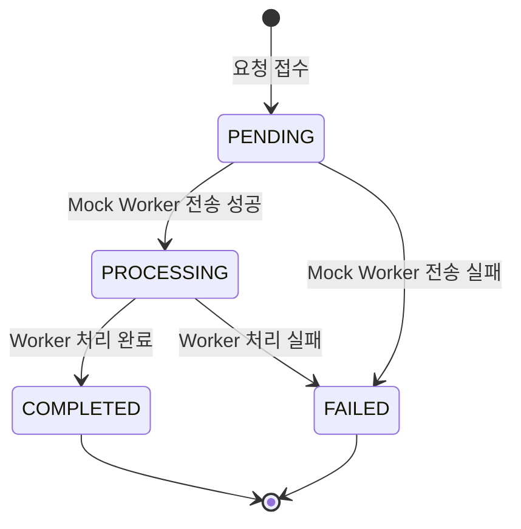

# 이미지 처리 비동기 잡 서버

클라이언트의 이미지 처리 요청을 받아 외부 AI 추론 서비스(Mock Worker)에 위임하고, 작업 상태와 결과를 관리하는 비동기 잡 처리 서버입니다.

## 기술 스택

- Java 17, Spring Boot 4.0.5
- Spring Data JPA, Flyway, MySQL 8
- WebFlux (WebClient — 외부 HTTP 통신 전용)
- Resilience4j (서킷브레이커, 재시도)
- Docker, Docker Compose

---

## 실행 방법

### 사전 요구사항

- Docker, Docker Compose

### 실행

```bash
cp .env.example .env
```

`.env` 파일에 본인의 이름과 이메일을 입력합니다. Mock Worker API Key 발급에 사용됩니다.

```
MOCK_WORKER_CANDIDATE_NAME=홍길동
MOCK_WORKER_EMAIL=example@email.com
```

```bash
docker compose up --build
```

- 앱 포트: `8080`
- Swagger UI: http://localhost:8080/swagger-ui/index.html

### 테스트

```bash
./gradlew test
```

Repository 테스트에서 Testcontainers로 MySQL 컨테이너를 자동 실행하므로, Docker Desktop이 실행 중이어야 합니다.

---

## API 명세

### 이미지 처리 요청

```
POST /api/v1/jobs
```

| 필드 | 타입 | 설명 |
|------|------|------|
| imageUrl | String | 처리할 이미지 URL (필수) |

- `201 Created` — 신규 잡 생성
- `200 OK` — 동일 요청의 기존 잡 반환 (중복 요청)

### 단건 조회

```
GET /api/v1/jobs/{jobId}
```

- `200 OK` — 잡 상태 및 결과 반환
- `404 Not Found` — 존재하지 않는 jobId

### 목록 조회

```
GET /api/v1/jobs?status={status}&page={page}&size={size}
```

- `status` (선택): PENDING, PROCESSING, COMPLETED, FAILED
- 기본 정렬: 생성일 내림차순

### 응답 형식

```json
{
  "jobId": "UUID",
  "status": "PENDING | PROCESSING | COMPLETED | FAILED",
  "imageUrl": "https://...",
  "result": "처리 결과 (COMPLETED 시)",
  "errorMessage": "실패 사유 (FAILED 시)",
  "createdAt": "2026-04-27T12:00:00",
  "updatedAt": "2026-04-27T12:00:05"
}
```

---

## 아키텍처

### DB 큐 패턴

```mermaid
flowchart LR
    Client["클라이언트"] -->|POST /api/v1/jobs| App["Spring Boot"]
    App -->|INSERT PENDING| DB["MySQL<br/>jobs 테이블"]
    DB -->|3초 주기 폴링| Dispatcher["JobDispatcher"]
    Dispatcher -->|POST /mock/process| Worker["Mock Worker"]
    Dispatcher -->|PENDING → PROCESSING| DB
    DB -->|5초 주기 폴링| Poller["JobPoller"]
    Poller -->|GET /mock/process/{id}| Worker
    Poller -->|PROCESSING → COMPLETED/FAILED| DB
```

`jobs` 테이블이 메시지 큐 역할을 합니다. 별도의 메시지 브로커(Redis, RabbitMQ 등) 없이 MySQL만으로 비동기 처리 파이프라인을 구성했습니다.

**이 방식을 선택한 이유:**

과제 규모에서 메시지 브로커는 운영 복잡성 대비 이점이 크지 않습니다. MySQL의 `FOR UPDATE SKIP LOCKED`는 행 수준 잠금과 잠긴 행 건너뜀을 지원하므로, 단일 테이블만으로도 동시성 안전한 큐 동작이 가능합니다. 평가자가 `docker compose up` 한 번으로 전체 시스템을 실행할 수 있다는 점도 고려했습니다.

**컴포넌트 역할:**

| 컴포넌트 | 주기 | 배치 | 역할 |
|----------|------|------|------|
| JobDispatcher | 3초 | 10건 | PENDING 잡을 Mock Worker에 전송 |
| JobPoller | 5초 | 10건 | PROCESSING 잡의 완료 여부를 Mock Worker에 확인 |

---

## 상태 모델

### 상태 다이어그램



### 각 상태의 의미

| 상태 | 의미 |
|------|------|
| PENDING | 요청이 접수되어 Mock Worker 전송을 대기 중 |
| PROCESSING | Mock Worker에 전송되어 처리 진행 중 |
| COMPLETED | 처리 완료, result 필드에 결과 포함 |
| FAILED | 처리 실패, errorMessage 필드에 사유 포함 |

### 허용되지 않는 전이

COMPLETED와 FAILED는 종단 상태(terminal state)입니다. 이 상태에서는 어떤 전이도 허용되지 않습니다. 또한 PROCESSING에서 PENDING으로의 되돌림도 정상 흐름에서는 허용되지 않습니다.

### 설계 의도

상태 전이 규칙은 `JobStatus` enum에 정의하고, 전이 실행은 `Job` 엔티티의 메서드(`markProcessing`, `markCompleted`, `markFailed`)를 통해서만 가능하도록 했습니다. 외부에서 상태 필드를 직접 변경할 수 없으므로, 허용되지 않은 전이가 코드 레벨에서 차단됩니다.

`resetToPending()`은 서버 재시작 복구 전용 메서드로, enum의 정상 전이 규칙을 의도적으로 우회합니다. enum에 PROCESSING→PENDING 전이를 추가하면 정상 플로우에서도 되돌림이 가능해지므로, 복구 전용임이 명확하도록 별도 메서드로 분리했습니다.

---

## 중복 요청 처리

동일한 이미지 URL에 대해 여러 번 요청이 들어올 수 있으므로, 불필요한 중복 처리를 방지합니다.

### 동작 방식

1. 요청된 `imageUrl`의 SHA-256 해시를 계산하여 `request_hash` 컬럼에 저장
2. 동일 해시를 가진 기존 잡 중 활성 상태(PENDING, PROCESSING, COMPLETED)가 있으면 해당 잡을 반환
3. FAILED 상태만 존재하는 경우에는 새 잡 생성을 허용 (재시도 의미)

### HTTP 응답 구분

| 상황 | 응답 |
|------|------|
| 신규 잡 생성 | `201 Created` |
| 기존 활성 잡 반환 | `200 OK` |

### 설계 의도

imageUrl 단위로 멱등성을 보장하여, 클라이언트의 중복 요청이 Mock Worker에 불필요한 부하를 발생시키지 않도록 합니다. FAILED 잡은 재시도가 필요할 수 있으므로 새 잡 생성을 허용합니다.

SHA-256 해시를 사용한 이유는 URL의 길이가 가변적이므로 고정 길이(64자) 해시로 인덱스 효율을 확보하기 위함입니다.

---

## 실패 처리 전략

외부 서비스인 Mock Worker는 응답 시간과 안정성이 변동될 수 있으므로, 다층적인 실패 처리 전략을 적용했습니다.

### 재시도 (Retry)

Mock Worker 호출 시 일시적 장애에 대해 재시도를 수행합니다.

- 최대 3회 시도 (초기 1회 + 재시도 2회)
- 재시도 간격: 500ms 고정
- 재시도 대상: `429 Too Many Requests`, `5xx Server Error`, 네트워크 오류
- 즉시 실패: `4xx Client Error`(429 제외), `404 Not Found`

`@Retry` 어노테이션 대신 reactor `retryWhen()`을 사용했습니다. `@CircuitBreaker(fallbackMethod=...)`의 AOP가 재시도 가능한 예외를 가로채 fallback으로 변환하면 `@Retry`가 재시도 조건을 판별할 수 없는 충돌 문제가 있기 때문입니다.

### 서킷브레이커 (Circuit Breaker)

Mock Worker의 연속 실패 시 빠른 실패 처리로 시스템 자원을 보호합니다.

| 설정 | 값 | 의미 |
|------|------|------|
| failure-rate-threshold | 50% | 실패율 50% 이상이면 OPEN |
| sliding-window-size | 10 | 최근 10건 호출로 실패율 계산 |
| minimum-number-of-calls | 5 | 최소 5건 호출 후 판단 시작 |
| wait-duration-in-open-state | 10초 | OPEN 상태 유지 시간 |
| permitted-number-of-calls-in-half-open-state | 3 | HALF_OPEN에서 허용하는 시도 횟수 |

### Dispatcher와 Poller의 비대칭 전략

실패 시 동작이 Dispatcher와 Poller에서 의도적으로 다릅니다.

**JobDispatcher — 전송 실패 시 즉시 FAILED:**
Dispatcher에서 `MockWorkerException`이 발생하면 해당 잡을 즉시 FAILED로 전이합니다. 이 시점에서 이미 Resilience4j 재시도 3회를 모두 소진한 상태이므로, 추가 재시도보다는 명확한 실패 처리가 적절합니다.

**JobPoller — 폴링 실패 시 재시도:**
Poller에서 `MockWorkerException`이 발생하면 FAILED 처리하지 않고 로그만 남깁니다. Mock Worker에 잡이 이미 전송되어 처리 중일 수 있으므로, 일시적 네트워크 장애로 폴링이 실패하더라도 다음 주기(5초 후)에 자연스럽게 재폴링됩니다.

---

## 동시 요청 처리

### FOR UPDATE SKIP LOCKED

Dispatcher와 Poller가 잡을 조회할 때 `SELECT ... FOR UPDATE SKIP LOCKED` 쿼리를 사용합니다.

- `FOR UPDATE`: 선택된 행에 행 수준 잠금(row-level lock)을 설정
- `SKIP LOCKED`: 다른 트랜잭션이 이미 잠근 행은 건너뜀

서버 인스턴스가 여러 개이거나 스케줄러가 겹쳐 실행되더라도, 같은 잡을 중복 처리하지 않습니다.

### 독립 트랜잭션

각 잡의 처리는 `@Transactional(propagation = REQUIRES_NEW)`로 독립된 트랜잭션에서 실행됩니다. 배치 내 한 잡이 실패하더라도 나머지 잡의 처리에 영향을 주지 않습니다.

### 인덱스

```sql
CREATE INDEX idx_jobs_status_created_at ON jobs (status, created_at);
```

Dispatcher/Poller의 `WHERE status = ? ORDER BY created_at` 쿼리가 인덱스를 활용하여 효율적으로 동작합니다.

---

## 처리 보장 모델

### at-least-once

본 시스템은 **at-least-once** 처리 보장 모델을 채택했습니다.

**근거:**

서버가 재시작되면 `JobRecoveryService`가 PROCESSING 상태의 잡을 PENDING으로 리셋하여 재처리합니다. Mock Worker에 이미 전송된 잡이더라도 PENDING으로 되돌려 다시 전송하므로, 어떤 잡도 처리되지 않고 누락되는 경우는 없습니다.

**트레이드오프:**

Mock Worker에 동일한 요청이 중복 전송될 수 있습니다. 예를 들어, Worker가 잡을 이미 처리 완료했지만 서버가 결과를 수신하기 전에 재시작되면, 복구 후 동일 잡이 다시 전송됩니다. 이는 at-least-once의 본질적인 한계이며, 요청 누락(at-most-once)보다는 중복 처리가 안전하다고 판단했습니다.

---

## 서버 재시작 시 동작

### 복구 프로세스

서버가 시작되면 `ApplicationReadyEvent` 시점에 다음 순서로 복구가 진행됩니다.

1. **API Key 재발급** (`@Order(1)`): Mock Worker API Key를 새로 발급받습니다.
2. **잡 복구** (`@Order(2)`): PROCESSING 상태의 모든 잡을 PENDING으로 리셋합니다.

리셋된 잡은 다음 Dispatcher 주기(3초)에 자연스럽게 Mock Worker에 재전송됩니다.

### 데이터 정합성 위험 지점

**1. Worker 처리 완료 후 서버 재시작:**
Mock Worker가 이미 처리를 완료했지만, 서버가 결과를 수신하기 전에 재시작된 경우 해당 잡은 PENDING으로 리셋되어 다시 전송됩니다. 동일한 이미지에 대해 Worker 측에서 중복 처리가 발생할 수 있습니다.

**2. API Key 재발급:**
서버가 재시작되면 API Key를 새로 발급받습니다. 이전 키로 전송된 PROCESSING 잡은 이미 Worker에 접수되어 있으므로 처리에는 영향이 없지만, 복구 후 재전송 시에는 새 키가 사용됩니다.

---

## 트래픽 증가 시 병목 지점

### 1. DB 폴링 주기

Dispatcher(3초)와 Poller(5초)의 고정 주기 폴링은 처리량에 상한을 만듭니다. 배치 사이즈가 10이므로 이론적 최대 처리량은 약 200건/분(10건 x 20회/분)입니다. 요청 유입 속도가 이를 초과하면 PENDING 잡이 누적됩니다.

### 2. 단일 MySQL 인스턴스

모든 잡 상태 관리, 큐 동작, 중복 검사가 단일 MySQL에 의존합니다. 트래픽이 증가하면 커넥션 풀 고갈, 행 잠금 경합이 병목이 될 수 있습니다.

### 3. Mock Worker 응답 시간

Mock Worker의 응답 시간(수초~수십초)은 제어할 수 없습니다. 응답이 느려지면 PROCESSING 잡이 누적되고, Poller가 동일한 잡을 반복 확인하게 되어 효율이 떨어집니다.

### 개선 방향

- **메시지 브로커 도입**: Redis/RabbitMQ로 DB 폴링을 이벤트 기반 처리로 전환
- **수평 확장**: 서버 인스턴스를 늘려 Dispatcher/Poller 처리량 분산 (SKIP LOCKED 덕분에 안전)
- **동적 배치 사이즈**: 큐 적재량에 따라 배치 크기를 조절하여 처리량 탄력 확보

---

## 외부 시스템 연동

### Mock Worker 연동 방식

Mock Worker는 이미지 처리를 수행하는 외부 AI 추론 서비스입니다. 요청 접수 시 `workerJobId`를 즉시 반환하고, 실제 처리는 비동기로 진행됩니다.

```
제출: POST /mock/process → workerJobId 반환 (즉시)
폴링: GET /mock/process/{workerJobId} → PROCESSING | COMPLETED | FAILED
인증: X-API-KEY 헤더 (앱 시작 시 자동 발급)
```

### 비동기 DB 큐 + 폴링 방식을 선택한 이유

Mock Worker는 응답에 수초~수십초가 소요되는 장기 작업을 처리합니다. 클라이언트 요청을 동기적으로 Mock Worker에 연결하면 HTTP 연결이 장시간 점유되어 서버 자원이 고갈됩니다.

따라서 요청 접수와 실제 처리를 분리하는 비동기 패턴을 적용했습니다. 클라이언트는 즉시 `jobId`를 받고, 내부 스케줄러가 주기적으로 Worker에 작업을 전송하고 결과를 회수합니다.

Webhook 대신 폴링을 사용한 이유는 Mock Worker가 콜백 기능을 제공하지 않기 때문입니다.

### WebClient

Spring WebFlux의 `WebClient`를 사용했습니다. 논블로킹 HTTP 클라이언트로, 스레드 점유 없이 외부 호출이 가능합니다. Spring 생태계와의 통합이 자연스럽고, Resilience4j와의 조합도 용이합니다.

### Resilience4j

Spring Boot 자동 구성을 지원하며, 서킷브레이커와 재시도를 선언적으로 구성할 수 있습니다. `application.yml`에서 설정값을 관리하므로 운영 환경에 따라 튜닝이 가능합니다.
